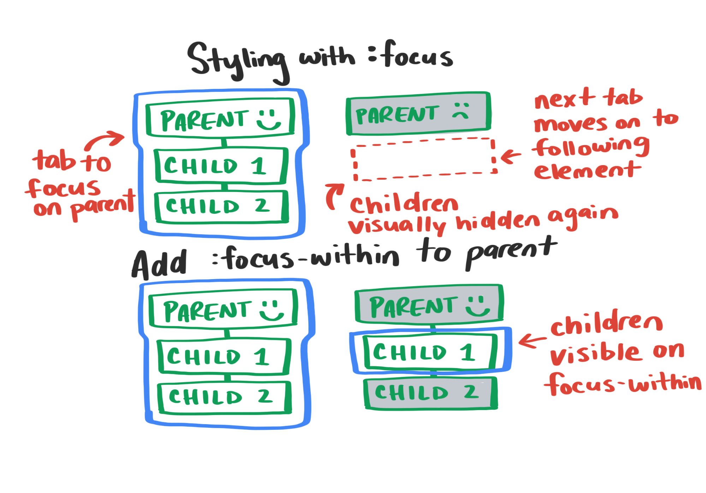
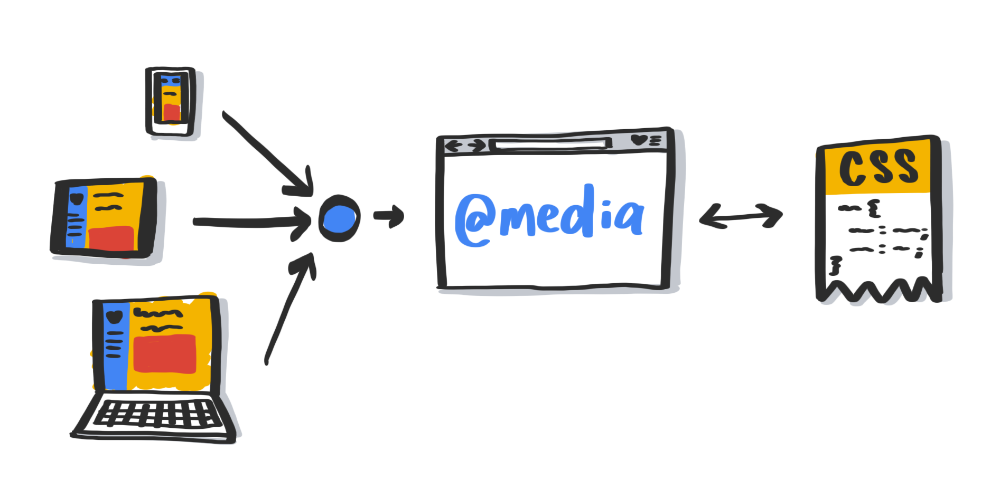
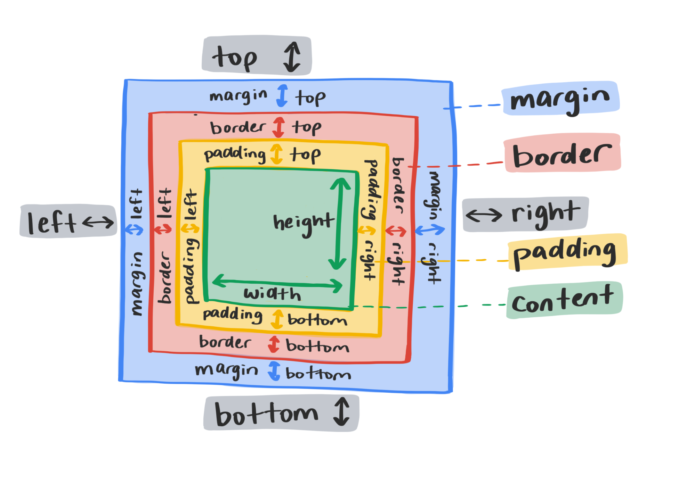
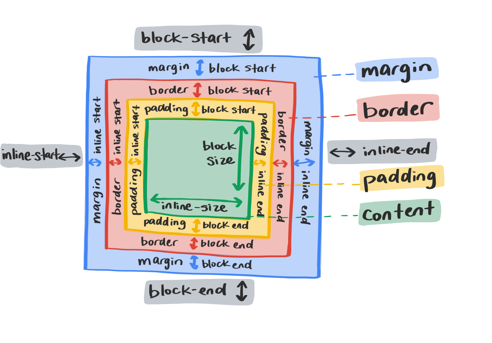
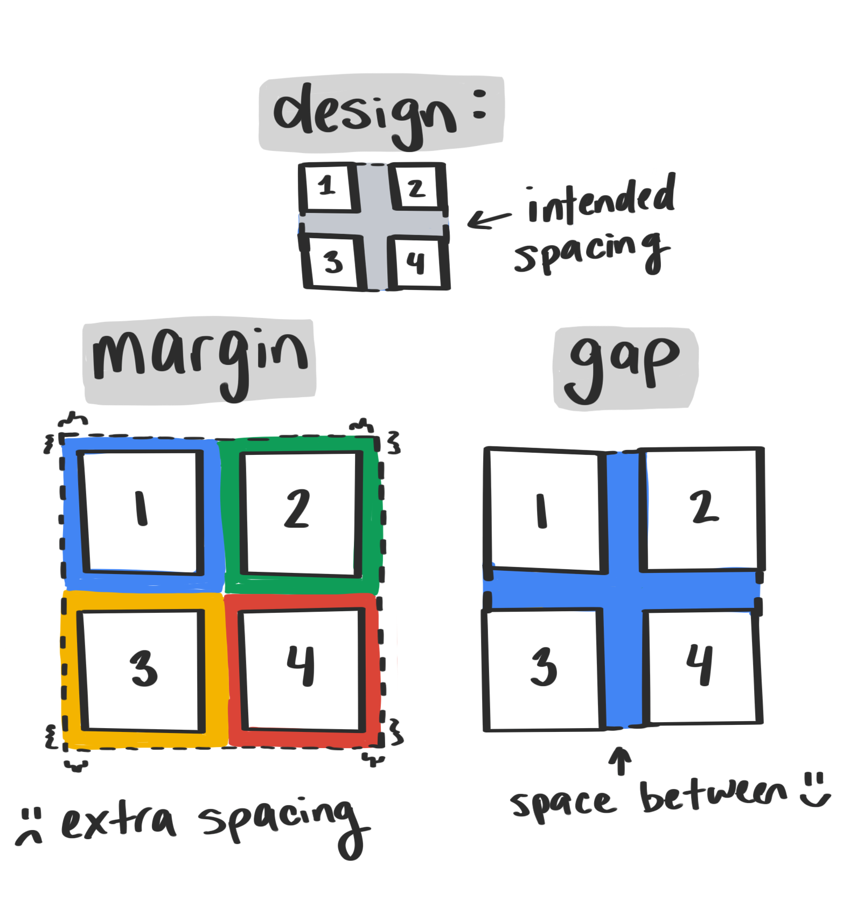
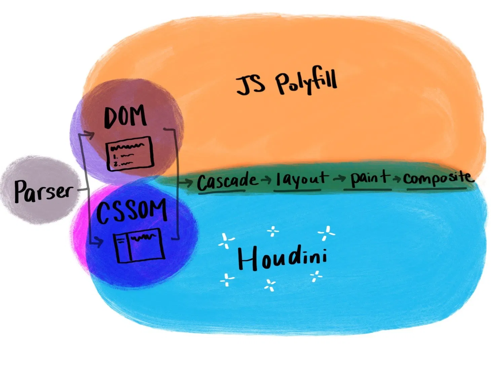

There are a _ton_ of exciting things happening in CSS right now—and
many of them are already supported in today's browsers!
Our talk at CDS 2019, which you can watch below,
covers several new and upcoming features we thought should get some attention.

This post focuses on the features you can use today,
so be sure to watch the talk
for a deeper discussion of upcoming features like Houdini.
You can also find demos for all the features we discuss on our
[CSS@CDS page](a.nerdy.dev/css-at-cds).



## Contents

- [Scroll Snap](#scroll-snap)
- [`:focus-within`](#:focus-within)
- [Media Queries Level 5](#media-queries-level-5)
- [Logical properties](#logical-properties)
- [`position: sticky`](#position:-sticky)
- [`backdrop-filter`](#backdrop-filter)
- [`:is()`](#is)
- [`gap`](#gap)
- [CSS Houdini](#css-houdini)
- [Overflow](#overflow)

## Scroll Snap

[Scroll Snap](https://developer.mozilla.org/en-US/docs/Web/CSS/CSS_Scroll_Snap/Basic_concepts) lets you define snap points as the user scrolls your content vertically, horizontally, or  both. It offers native scroll inertia and deceleration, and it's touch enabled.

This sample code sets up horizontal scrolling in a `<section>` element with snap points aligned to the left sides of child `<picture>` elements:

```css
section {
  overflow-x: auto;
  overscroll-behavior-x: contain;
  scroll-snap-type: x mandatory;
}

section > picture {
  scroll-snap-align: start;
}
```

Here's how it works:

*   On the parent `<section>` element,
    *   `overflow-x` is set to `auto` to allow horizontal scrolling.
    *   `overscroll-behavior-x` is set to `contain` to prevent any parent elements from scrolling when the user reaches the boundaries of the `<section>` element's scroll area. (This isn't strictly necessary for snapping, but it's usually a good idea.)
    *   `scroll-snap-type` is set to `x`—for horizontal snapping—and `mandatory`—to ensure that the viewport always snaps to the closest snap point.
*   On the child `<picture>` elements, `scroll-snap-align` is set to start, which sets the snap points on the left side of each picture (assuming `direction` is set to `ltr`).

And here's a live demo:

<iframe height="520" style="display: block; width: 400px; max-width: 100%; margin: 0 auto;" scrolling="no" title="Awww Scroll Snap [horizontal]" src="https://codepen.io/argyleink/embed/zYYZPqb?height=916&theme-id=dark&default-tab=result" frameborder="no" allowtransparency="true" allowfullscreen="true">
  See the Pen <a href='https://codepen.io/argyleink/pen/zYYZPqb'>Awww Scroll Snap [horizontal]</a> by Adam Argyle
  (<a href='https://codepen.io/argyleink'>@argyleink</a>) on <a href='https://codepen.io'>CodePen</a>.
</iframe>

You can also take a look at demos for [vertical scroll snap](https://codepen.io/argyleink/pen/oNNZoZj) and [matrix scroll snap](https://codepen.io/argyleink/pen/MWWpOmz).


While scroll snap supports vertical snapping, be cautious when using it at the page level since it can feel like control is being taken from the user in some cases. It's usually best to apply snapping to a component on your page rather than the page itself.


## `:focus-within`

[`:focus-within`](https://developer.mozilla.org/en-US/docs/Web/CSS/:focus-within) addresses a long-standing accessibility issue: there are many cases when focusing a child element should affect the presentation of a parent element so that the UI is accessible to users of assistive technologies.

For example, if you have a dropdown menu with several items, the menu should remain visible while any of the items has focus. Otherwise, the menu disappears for keyboard users.

`:focus-within` tells the browser to apply a style when focus is on any child element of a specified element. Returning to the menu example, by setting `:focus-within` on the menu element, you can make sure it stays visible when a menu item has focus:

```css
.menu:focus-within {
  display: block;
  opacity: 1;
  visibility: visible;
}
```



Try tabbing through the focusable elements in the demo below. You'll notice that the menus remain visible as you focus on the menu items:

<iframe height="275" style="width: 100%;" scrolling="no" title="Simple CSS Dropdown Menu with Hover and :focus-within and Focus states" src="https://codepen.io/una/embed/RMmogp?height=265&theme-id=dark&default-tab=result" frameborder="no" allowtransparency="true" allowfullscreen="true">
  See the Pen <a href='https://codepen.io/una/pen/RMmogp'>Simple CSS Dropdown Menu with Hover and :focus-within and Focus states</a> by Una Kravets
  (<a href='https://codepen.io/una'>@una</a>) on <a href='https://codepen.io'>CodePen</a>.
</iframe>

## Media Queries Level 5

[New media queries](https://drafts.csswg.org/mediaqueries-5/#environment-blending) give us powerful ways to adjust the user experience of our apps based on a user's device preferences. Basically, the browser serves as a proxy for system-level preferences that we can respond to in our CSS using the `prefers-*` group of media queries:



Here are the new queries we think developers will be most excited about:

*   [prefers-reduced-motion](https://developers.google.com/web/updates/2019/03/prefers-reduced-motion)
*   [prefers-color-scheme](https://web.dev/prefers-color-scheme/)
*   [prefers-contrast](https://developer.mozilla.org/en-US/docs/Web/CSS/@media/prefers-contrast)
*   [prefers-reduced-transparency](https://developer.mozilla.org/en-US/docs/Web/CSS/@media/prefers-reduced-transparency)
*   [forced-colors](https://developer.mozilla.org/en-US/docs/Web/CSS/@media/forced-colors)
*   [inverted-colors](https://developer.mozilla.org/en-US/docs/Web/CSS/@media/inverted-colors)
*   [light-level](https://developer.mozilla.org/en-US/docs/Web/CSS/@media/light-level)

These queries are a huge win for accessibility. Previously we had no way to know, for example, that a user had set their OS to high-contrast mode. If you wanted to provide a high-contrast mode for a web app that remained true to your brand, you had to ask users to choose it from UI within your app. Now you can detect the high-contrast setting from the OS using `prefers-contrast`.

One exciting implication of these media queries is that we can design for multiple combinations of system-level user preferences to accommodate the wide range of user preferences and accessibility needs. If a user wants high-contrast dark mode when in dimly lit environments, you can do that!

It's important to Adam that "prefers reduced motion" doesn't get implemented as "no motion." The user is saying they prefer less motion, not that they don't want any animation. He asserts reduced motion is not no motion. Here's an example that uses a crossfade animation when the user prefers reduced motion:

<figure class="w-figure w-figure--center">
  <video controls autoplay loop muted>
    <source src="https://storage.googleapis.com/web-dev-assets/next-gen-css-2019/reduced-motion.webm" type="video/webm; codecs=vp8">
    <source src="https://storage.googleapis.com/web-dev-assets/next-gen-css-2019/reduced-motion.mp4" type="video/mp4; codecs=h264">
  </video>
</figure>


In Chrome Canary, you can test CSS that uses `prefers-reduced-motion` or `prefers-color-scheme` by choosing the appropriate settings in the DevTools **Rendering** drawer. To access **Rendering**, [open the Command Menu](https://developers.google.com/web/tools/chrome-devtools/command-menu) and run the `Show Rendering` command.


## Logical properties

[Logical properties](https://developer.mozilla.org/en-US/docs/Web/CSS/CSS_Logical_Properties) solve a problem that has gained visibility as more developers tackle internationalization. Many layout properties like `margin` and `padding` assume a language that is read top-to-bottom and left-to-right.



When designing pages for multiple languages with varying writing modes, developers have had to adjust all those properties individually across multiple elements, which quickly becomes a maintainability nightmare.

Logical properties let you maintain layout integrity across translations and writing modes. They dynamically update based on the semantic ordering of content rather than its spatial arrangement. With logical properties, each element has two dimensions:

*   The **block** dimension is **perpendicular** to the flow of text in a line. (In English, `block-size` is the same as `height`.)
*   The **inline** dimension is **parallel** to the flow of text in a line. (In English, `inline-size` is the same as `width`.)

These dimension names apply to all logical layout properties. So, for example, in English, `block-start` is the same as `top`, and `inline-end` is the same as `right`.



With logical properties, you can automatically update your layout for other languages by simply changing the `writing-mode` and `direction` properties for your page rather than updating dozens of layout properties on individual elements.

You can see how logical properties work in the demo below by setting the `writing-mode` property on the `<body>` element to different values:

<iframe height="750" style="width: 100%;" scrolling="no" title="Logical Properties Demo" src="https://codepen.io/una/embed/mddxpaY?height=265&theme-id=dark&default-tab=css,result" frameborder="no" allowtransparency="true" allowfullscreen="true">
  See the Pen <a href='https://codepen.io/una/pen/mddxpaY'>Logical Properties Demo</a> by Una Kravets
  (<a href='https://codepen.io/una'>@una</a>) on <a href='https://codepen.io'>CodePen</a>.
</iframe>

## `position: sticky`

An element with [`position: sticky`](https://developer.mozilla.org/en-US/docs/Web/CSS/position#Sticky_positioning) remains in block flow until it starts to go offscreen,
at which point it stops scrolling with the rest of the page
and sticks to the position specified by the element's `top` value.
The space allocated for that element remains in the flow,
and the element returns to it when the user scrolls back up.

Sticky positioning lets you create many useful effects that previously required JavaScript. To show some of the possibilities, we've created several demos. Each demo uses largely the same CSS and only slightly adjusts the HTML markup to create each effect.

### [Sticky Stack](https://codepen.io/argyleink/pen/YzzZyMx)

In this demo, all sticky elements share the same container. That means that each sticky element slides over the previous one as the user scrolls down. The sticky elements share the same stuck position.

<figure class="w-figure w-figure--center">
  <video controls autoplay loop muted>
    <source src="https://storage.googleapis.com/web-dev-assets/next-gen-css-2019/sticky-stack.webm" type="video/webm; codecs=vp8">
    <source src="https://storage.googleapis.com/web-dev-assets/next-gen-css-2019/sticky-stack.mp4" type="video/mp4; codecs=h264">
  </video>
</figure>

### [Sticky Slide](https://codepen.io/argyleink/pen/abbJOjP)

Here, the sticky elements are cousins. (That is, their parents are siblings.) When a sticky element hits the lower boundary of its container, it moves up with the container, creating the impression that lower sticky elements are pushing up higher ones. In other words, they appear to compete for the stuck position.

<figure class="w-figure w-figure--center">
  <video controls autoplay loop muted>
    <source src="https://storage.googleapis.com/web-dev-assets/next-gen-css-2019/sticky-slide.webm" type="video/webm; codecs=vp8">
    <source src="https://storage.googleapis.com/web-dev-assets/next-gen-css-2019/sticky-slide.mp4" type="video/mp4; codecs=h264">
  </video>
</figure>

### [Sticky Desperado](https://codepen.io/argyleink/pen/qBBrbyx)

Like Sticky Slide, the sticky elements in this demo are cousins. However, they've been placed in containers set to a two-column grid layout.

<figure class="w-figure w-figure--center">
  <video controls autoplay loop muted>
    <source src="https://storage.googleapis.com/web-dev-assets/next-gen-css-2019/sticky-desperado.webm" type="video/webm; codecs=vp8">
    <source src="https://storage.googleapis.com/web-dev-assets/next-gen-css-2019/sticky-desperado.mp4" type="video/mp4; codecs=h264">
  </video>
</figure>

## `backdrop-filter`

The [`backdrop-filter`](https://developer.mozilla.org/en-US/docs/Web/CSS/backdrop-filter) property lets you apply graphical effects to the area _behind_ an element rather than to the element itself. This makes lots of cool effects that were previously only achievable using complicated CSS and JavaScript hacks doable with one line of CSS.

For example, this demo uses `backdrop-filter` to achieve native OS-style blurring:

<iframe height="510" style="width: 100%;" scrolling="no" title="mddjjor" src="https://codepen.io/una/embed/mddjjor?height=265&theme-id=dark&default-tab=result" frameborder="no" allowtransparency="true" allowfullscreen="true">
  See the Pen <a href='https://codepen.io/una/pen/mddjjor'>mddjjor</a> by Una Kravets
  (<a href='https://codepen.io/una'>@una</a>) on <a href='https://codepen.io'>CodePen</a>.
</iframe>

We already have a [great post about `backdrop-filter`](https://web.dev/backdrop-filter/), so head there for more info.

## `:is()`

While the [`:is()` pseudo-class](https://developer.mozilla.org/en-US/docs/Web/CSS/:is) is actually over ten years old, it still doesn't see as much use as we think it deserves. It takes a comma-separated list of selectors as its argument and matches any selectors in that list. That flexibility makes it incredibly handy and can significantly reduce the amount of CSS you ship.

Here's a quick example:

<figure class="w-figure">
  <video controls autoplay loop muted>
    <source src="https://storage.googleapis.com/web-dev-assets/next-gen-css-2019/is-animation.webm" type="video/webm; codecs=vp8">
    <source src="https://storage.googleapis.com/web-dev-assets/next-gen-css-2019/is-animation.mp4" type="video/mp4; codecs=h264">
  </video>
</figure>

## `gap`

[CSS grid layout](https://developer.mozilla.org/en-US/docs/Web/CSS/CSS_Grid_Layout) has had [`gap`](https://developer.mozilla.org/en-US/docs/Web/CSS/gap) (previously `grid-gap`) for some time. By specifying the internal spacing of a containing element rather than the spacing around child elements, `gap` solves many common layout issues. For example, with gap, you don't have to worry about margins on child elements causing unwanted whitespace around the edges of a containing element:



Even better news: `gap` is coming to flexbox, bringing all the same spacing perks that grid has:

*   There's one spacing declaration rather than many.
*   There's no need to establish conventions for your project about which child elements should own spacing—the containing element owns the spacing instead.
*   The code is more easily understandable than older strategies like the [lobotomized owl](https://alistapart.com/article/axiomatic-css-and-lobotomized-owls/).

The following video shows the benefits of using a single `gap` property for two elements, one with a grid layout and one with a flex layout:

Right now, only FireFox supports `gap` in flex layouts, but play around with this demo to see how it works:

<iframe height="600" style="width: 100%;" scrolling="no" title="Gappy" src="https://codepen.io/argyleink/embed/abbVqEv?height=265&theme-id=dark&default-tab=css,result" frameborder="no" allowtransparency="true" allowfullscreen="true">
  See the Pen <a href='https://codepen.io/argyleink/pen/abbVqEv'>Gappy</a> by Adam Argyle
  (<a href='https://codepen.io/argyleink'>@argyleink</a>) on <a href='https://codepen.io'>CodePen</a>.
</iframe>

## CSS Houdini

[Houdini](https://developer.mozilla.org/en-US/docs/Web/Houdini) is a set of low-level APIs for the browser's rendering engine that lets you tell the browser how to interpret custom CSS. In other words, it gives you access to the [CSS Object Model](https://developer.mozilla.org/en-US/docs/Web/API/CSS_Object_Model), letting you _extend_ CSS via Javascript. This has several benefits:

*   It gives you much more power to create custom CSS features.
*   It's easier to separate rendering concerns from application logic.
*   It's more performant than the CSS polyfilling we currently do with JavaScript since the browser will no longer have to parse scripts and do a second rendering cycle; Houdini code is parsed in the first rendering cycle.



Houdini is an umbrella name for [several APIs](https://developer.mozilla.org/en-US/docs/Web/Houdini#The_Houdini_APIs). If you want more information about them and their current status, take a look at [Is Houdini Ready Yet?](https://ishoudinireadyyet.com/) In our talk, we covered the Properties and Values API, the Paint API, and the Animation Worklet because they're currently the most supported. We could easily dedicate a full post to each of these exciting APIs, but, for now, check out our talk for an overview and some cool demos that start to give a sense of what you can do with the APIs.

## Overflow

There are a few more things on the horizon that we wanted to discuss but didn't have time to cover in depth, so we ran through them in a speed round.⚡ If you haven't heard of some of these features yet, be sure to watch [the last part of the talk](https://youtu.be/-oyeaIirVC0?t=1825)!

*   `size`: a property that will allow you to set height and width at the same time
*   `aspect-ratio`: a property that sets an aspect ratio for elements that don't have one intrinsically
*   `min()`, `max()`, and `clamp()`: functions that will let you set numeric constraints on any CSS property, not just width and height
*   `list-style-type` an existing property, but it will soon support a wider range of values, including emoji and SVGs
*   `display: outer inner`: The `display` property will soon accept two parameters, which will let you explicitly specify its outer and inner layouts rather than using compound keywords like `inline-flex`.
*   CSS regions: will let you fill a specified, non-rectangular area that content can flow within
*   CSS modules: JavaScript will be able to request a CSS module and get a rich object back that's easy to perform operations on
